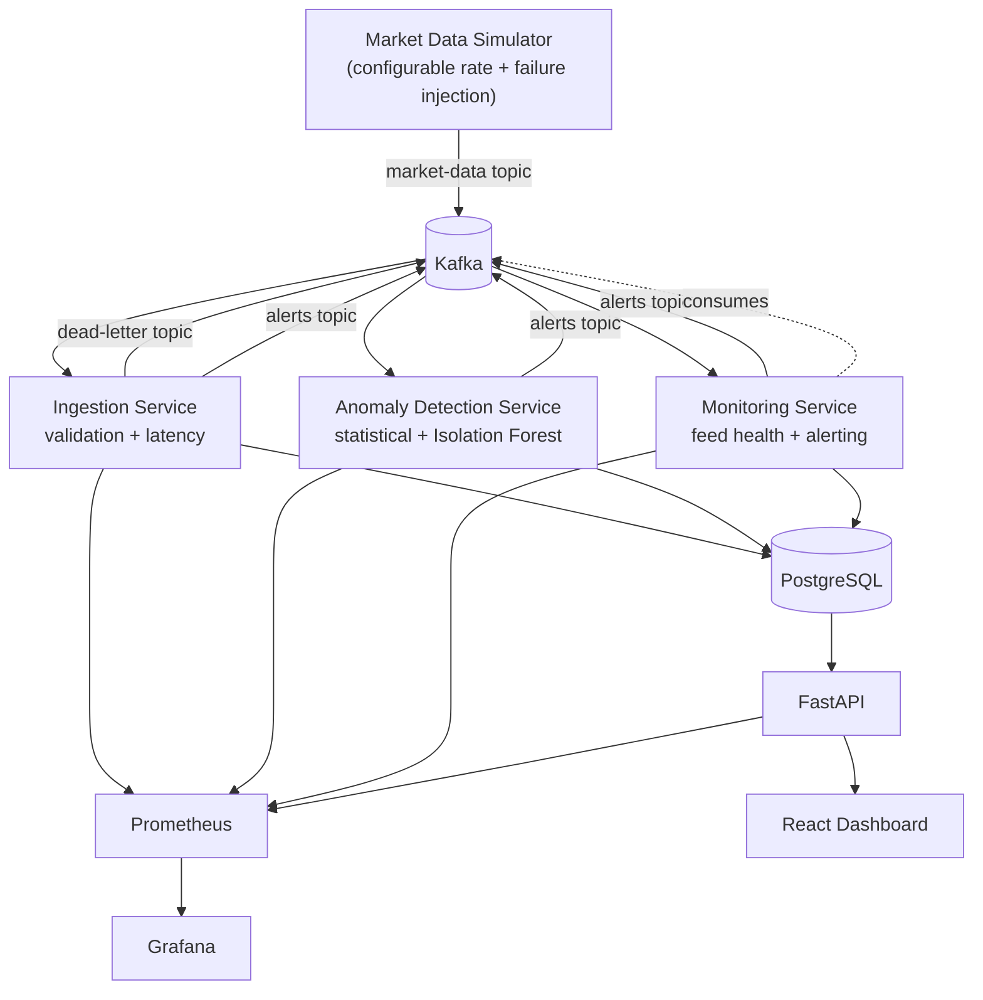

# PulseGuard

**Real-time market data reliability & anomaly detection platform.**

PulseGuard is not a stock predictor. It watches a simulated high-frequency
market-data feed and continuously answers one question:

> Is the feed healthy, timely, complete, and trustworthy right now?

It does that by combining deterministic validation, statistical and
machine-learning anomaly detection, latency/throughput monitoring, a
per-symbol feed-health state machine, and deduplicated alerting — the same
categories of signal a real market-data infrastructure team would build
around a live feed.

---

## 1. What PulseGuard is

A configurable market-data simulator publishes trade/quote/bid-ask events
for seven symbols (AAPL, MSFT, NVDA, GOOGL, AMZN, TSLA, META) onto Kafka at
a configurable rate (100 to 50,000+ msg/sec). The simulator can also
deliberately corrupt its own stream on demand — price spikes, negative
prices, bad quotes, duplicate messages, sequence gaps, stale/delayed
events, traffic bursts, feed pauses, and full outages — so every failure
mode PulseGuard claims to catch is reproducible on command.

Three independent consumer services process that stream:

- **ingestion** — deterministic validation, per-symbol latency measurement, dead-lettering of bad/corrupted payloads.
- **anomaly_detection** — rolling z-score/pct-change statistics *and* a per-symbol Isolation Forest, run in parallel.
- **monitoring** — a feed-health state machine (`HEALTHY` → `DEGRADED` → `STALE` → `OFFLINE`) and threshold-based alerting with deduplication/cooldown.

Everything they find is persisted to PostgreSQL and exposed through
Prometheus metrics, a provisioned Grafana dashboard, and a FastAPI + React
operations dashboard.

## 2. The problem it solves

Trading systems, risk engines, and analytics pipelines are only as good as
the market data feeding them. A feed can go quiet, start lagging, drop
messages, or emit garbage prices without ever throwing an exception —
nothing "crashes," the numbers are just wrong or missing. Consumers of that
data have no way to know unless something is watching the *feed itself*,
not just the individual services in the pipeline. PulseGuard is that
watcher.

## 3. Why market-data reliability matters

A single bad tick (a decimal-point error, a stale quote, a gap that hides a
real price move) can cascade into a bad trading decision, a broken risk
calculation, or a compliance problem — and by the time a human notices, the
damage is done. Real market-data infrastructure teams invest heavily in
exactly the categories PulseGuard implements: schema/sanity validation,
statistical outlier detection, latency SLOs, sequence-integrity checks, and
feed-health dashboards that are boring 99% of the time and load-bearing the
other 1%.

## 4. Architecture



Each Python service is independently deployable, has its own Kafka
consumer group, and exposes its own `/metrics` endpoint — there is no
shared in-process state between them. That is a deliberate simplicity
choice: it means any single service can be scaled (more replicas, more
partitions) or restarted without coordinating with the others, without
reaching for a heavier orchestration layer that this project doesn't need.

## 5. Data flow

1. The **simulator** advances a per-symbol random-walk price model, builds a `MarketEvent`, optionally mutates/delays/drops/duplicates it (failure injection), and publishes it to the `market-data` topic.
2. **ingestion** consumes `market-data` on its own consumer group, runs deterministic validation, measures `latency = receive_time - producer_timestamp`, and routes invalid/corrupted payloads to `market-data-dead-letter`. Validation findings (duplicates, sequence gaps, invalid events) become alerts.
3. **anomaly_detection** consumes the *same* `market-data` topic on its own consumer group (so a slow anomaly detector never blocks ingestion), computes a rolling feature vector per symbol, and scores it with both a statistical detector and a per-symbol Isolation Forest.
4. **monitoring** consumes `market-data` (for arrival/throughput/latency) and `alerts` (for error/anomaly rate) on its own consumer groups, runs the feed-health state machine every second per symbol, and emits `FEED_*`, `LATENCY_THRESHOLD_EXCEEDED`, `THROUGHPUT_DEGRADED`, `ERROR_RATE_HIGH`, and `CONSUMER_LAG_HIGH` alerts.
5. Alerts and anomalies are written directly to PostgreSQL by whichever service detects them, and also published to the `alerts` topic for real-time fan-out.
6. The **API** reads Postgres (history: alerts, anomalies, feed transitions) and queries Prometheus live (current rates/latency/lag) to serve the dashboard.

## 6. Anomaly detection

Two complementary, independently-run detectors:

- **Statistical / rule-based** — a rolling window (default 100 events) per symbol tracks price mean/std; a z-score beyond a configurable threshold (default 4.0) or a percent-change beyond a configurable threshold (default 3%) triggers an anomaly. Cheap, explainable, and what actually catches the simulator's injected spikes/crashes.
- **Isolation Forest** (`scikit-learn`) — trained per symbol on a rolling buffer of recent feature vectors (price return, quantity, spread, spread %, inter-arrival time, rolling volatility, price deviation from rolling mean, message latency), retrained periodically as the buffer grows. This is explicitly an *experimental, complementary* signal, not the primary line of defense — Isolation Forest trained on live (not curated-clean) data will occasionally be dulled by injected anomalies landing in its own training buffer, which is why the deterministic validation engine and the statistical detector run independently and are not gated on it.

Every detection (from either method, or from validation) is persisted to
the `anomalies` table with its score, method, severity, symbol, timestamp,
and the metrics that triggered it.

## 7. Kafka design

Three topics:

| Topic | Purpose | Partitions |
|---|---|---|
| `market-data` | Raw simulated events | 6 (parallelism for 3 independent consumer groups) |
| `market-data-dead-letter` | Invalid/corrupted/undeliverable payloads | 3 |
| `alerts` | Structured alerts from all three detection services | 3 |

Design choices: the producer (simulator) uses fire-and-forget `send()`
batched by `linger_ms` rather than `send_and_wait()` per message, because
awaiting a broker round-trip for every message caps throughput far below
what's needed at 10k–50k msg/sec. Consumers use `enable_auto_commit=False`
with manual offset commits after each processed batch (at-least-once
semantics) and a bounded concurrent-task pool per consumer
(`KAFKA_CONSUMER_CONCURRENCY`) so message handling isn't serialized behind
a single `await`. Retries use exponential backoff (`send_with_retry`); a
message that still fails goes to the dead-letter topic with the reason
attached, never silently dropped. Shutdown is graceful: `SIGTERM`/`SIGINT`
stop new work, drain in-flight handler tasks, then close the consumer,
producer, and DB pool.

## 8. Latency measurement

Every event carries `producer_timestamp` (set by the simulator at
generation time). On receipt, each consumer computes
`latency = receive_time - producer_timestamp` and records it into both a
Prometheus histogram (`pulseguard_market_data_latency_seconds`) and an
in-memory bounded rolling window (`RollingWindow`, `numpy`-backed) used for
local p50/p95/p99/max without ever querying Postgres on the hot path.
Percentiles for the dashboard/Grafana come from `histogram_quantile()` over
the Prometheus histogram, which is the standard, statistically-sound way to
approximate percentiles from bucketed counters at scale.

## 9. Storage strategy

**PulseGuard deliberately does not store every tick.** At 50,000 msg/sec
that's 4.3 billion rows/day — pointless to persist when the stream is
already durable in Kafka and every service that needs the raw event has it
in memory as it flows through. Postgres holds only the things that need to
survive a restart and be queryable historically: `alerts`,
`anomalies`, `feed_status_transitions`, and periodic `aggregated_metrics`.
An optional, disabled-by-default `recent_events` table exists for ad-hoc
debugging (a rate-limited sample of valid events), bounded by a retention
window rather than growing forever. See `database/init.sql`.

## 10. Dashboard

React + TypeScript (Vite), polling the API every 4 seconds — deliberately
not WebSockets, since a few-second staleness is fine for an ops dashboard
and polling is far simpler to reason about and demo. Shows:

- **Feed Health** — per-symbol state, throughput, p99 latency, last-seen.
- **System Metrics** — messages/sec, p95/p99 latency, active anomalies (5m), consumer lag, rejected/sec.
- **Live Alerts** — timestamp, severity, symbol, alert type/description, status (ACTIVE/RESOLVED).
- **Charts** — throughput, latency (p95/p99), and anomaly count, each as a live rolling window built from repeated polls (no separate time-series API needed).

Grafana (provisioned automatically, `infrastructure/grafana/provisioning`)
covers the same ground with real PromQL panels — Feed Overview, Latency
(p50/p95/p99/max), Anomalies (over time, by type, by symbol), and
Throughput (incoming/processing/rejected/consumer lag) — for anyone who
wants to explore raw metrics rather than the curated dashboard view.

## 11. Failure injection

Every category PulseGuard claims to detect can be forced via
`SIMULATOR_INJECT_*` environment variables (see `.env.example`): price
spikes/crashes, negative/zero prices, impossible bid/ask, extreme
quantities, duplicate events, sequence gaps, stale events, delayed
delivery, corrupted payloads (truncated/wrong-type/missing-field JSON), and
episodic bursts/pauses/full outages on independent timers. See
[Section 19](#19-example-failure-scenarios--how-to-demonstrate-them) below
for exact reproduction steps.

## 12. Performance benchmarks

**Honest status:** the development environment this project was built in
lost shell/Docker access mid-session, so the throughput benchmarks below
were *not* executed and no numbers are fabricated here. `scripts/benchmark.py`
and the `make bench-1k` / `make bench-10k` / `make bench-50k` targets are
provided and ready to run — `make up` followed by `make bench-10k` (which
sets `SIMULATOR_THROUGHPUT_MSG_PER_SEC` and streams for 60s) plus
`python scripts/benchmark.py --duration 60` will sample real
received/processed/rejected rates, p50/p95/p99 latency, and consumer lag
directly from Prometheus and print a summary. Pair that with `docker stats`
for CPU/memory. Please run these on your machine and drop the real numbers
into this section — that is what "do not make fake performance claims"
means in practice.

What *is* architecturally true regardless of the exact numbers: the
producer path never blocks on a broker round-trip per message, consumers
process a bounded number of messages concurrently instead of one-at-a-time,
and both the ingestion and anomaly-detection consumer groups can be scaled
horizontally (more partitions + more consumer replicas) without any code
change, since Kafka handles the partition rebalancing.

## 13. How to run it

```bash
cp .env.example .env
make up          # docker compose up --build -d
```

This brings up Kafka (KRaft mode, no ZooKeeper), Postgres, Prometheus,
Grafana, the simulator, all three detection services, the API, and the
dashboard.

| Service | URL |
|---|---|
| Dashboard | http://localhost:5173 |
| API docs (Swagger) | http://localhost:8000/docs |
| Grafana | http://localhost:3001 (admin/admin, or anonymous viewer) |
| Prometheus | http://localhost:9090 |

`make logs` tails every service. `make down` stops everything; `make clean`
also removes volumes (Kafka/Postgres data, Grafana state).

Unit tests (no infrastructure required):

```bash
make test-unit
```

Integration tests (require `make up` first):

```bash
make test-integration
```

## 14. Example failure scenarios — how to demonstrate them

**Scenario 1 — Price anomaly.** Set `SIMULATOR_INJECT_PRICE_SPIKE_PROB=0.05`
(or crash) and restart the simulator (`docker compose restart simulator`).
Expected: within seconds, `anomalies` rows appear with `detection_method`
`statistical` (and often `isolation_forest`), and a `PRICE_ANOMALY` /
`STATISTICAL_ANOMALY` alert shows up in the dashboard's Live Alerts panel.

**Scenario 2 — Feed outage.** `docker compose stop simulator`. Expected:
within `MONITORING_STALE_NO_MESSAGE_SECONDS` (5s) the affected feeds show
`STALE`; within `MONITORING_OFFLINE_NO_MESSAGE_SECONDS` (15s) they show
`OFFLINE` with a `CRITICAL` `FEED_OFFLINE` alert. Restart the simulator and
watch the feeds return to `HEALTHY`, which auto-resolves the open
`FEED_OFFLINE`/`FEED_STALE`/`FEED_DEGRADED` alerts for that feed.

**Scenario 3 — Latency degradation.** Set
`SIMULATOR_INJECT_DELAYED_EVENT_PROB=0.1` and restart the simulator.
Expected: `pulseguard_market_data_latency_seconds` p95/p99 rise, and once
p99 crosses `MONITORING_P99_LATENCY_ALERT_SECONDS` (default 1.0s) a `HIGH`
`LATENCY_THRESHOLD_EXCEEDED` alert fires.

**Scenario 4 — Sequence gaps.** Set `SIMULATOR_INJECT_SEQUENCE_GAP_PROB=0.05`
and restart. Expected: `SEQUENCE_GAP` (`MEDIUM`) alerts appear, one per
gap, deduplicated/cooled-down per symbol rather than spamming.

**Scenario 5 — Traffic burst.** Bursts are on by default
(`SIMULATOR_INJECT_BURST_ENABLED=true`, every 90s for 5s at 8x throughput).
Expected: `pulseguard_feed_messages_per_second` spikes, Kafka absorbs it
without error, and `pulseguard_kafka_consumer_lag` becomes visible on the
Throughput Grafana panel while consumers catch up.

## 15. Engineering trade-offs

- **Fire-and-forget send semantics, not fire-and-forget delivery guarantees**
  — every producer (`pulseguard_common.kafka_utils.make_producer`) uses
  `acks=-1` ("all") with `enable_idempotence=True`, the strongest delivery
  guarantee aiokafka offers (idempotence *requires* `acks=-1`; aiokafka
  rejects `acks=1` with idempotence on). The "fire-and-forget" part is on
  the caller's side: the simulator and every service call `producer.send()`
  and never `await` the returned future synchronously on the hot path, so
  the broker-side wait for in-sync-replica acknowledgment happens in the
  background and never throttles producer throughput. This gets both
  properties — high throughput and no silently-dropped/duplicated/reordered
  messages — without the trade-off a naive `acks=1`/no-idempotence setup
  would force.
- **Each service owns its own consumer group and re-derives what it needs
  from the raw stream** rather than one service computing shared state for
  the others. Slightly more redundant computation (e.g. monitoring
  computes its own latency independently of ingestion), but each service
  stays independently deployable/scalable and there's no shared-memory
  coordination problem to get wrong.
- **Isolation Forest trained online, not on a curated clean dataset** —
  simpler operationally (no separate training pipeline/artifact store) at
  the cost of occasional sensitivity dulling when anomalies land in its own
  training buffer. Mitigated by leaning on the deterministic validation and
  statistical detectors as the primary signal.
- **No tick-level persistence by default** — huge storage/cost savings,
  at the cost of not being able to replay exact historical ticks from
  Postgres (Kafka retention, currently 7 days on `market-data`, is the
  actual replay mechanism).
- **Polling dashboard instead of WebSockets/SSE** — much simpler client
  and server code, at the cost of a few seconds of staleness, which is
  fine for an operational awareness dashboard (not a trading UI).

## 16. Future improvements

- Kafka Streams-style windowed aggregation service instead of per-service
  in-memory rolling windows, for exact (not per-process-approximate)
  cross-replica percentiles once services are scaled to multiple replicas.
- A curated, periodically-refreshed "known good" training set for the
  Isolation Forest instead of training purely online.
- WebSocket push from the API for sub-second dashboard updates.
- Schema registry (Avro/Protobuf) instead of JSON for the Kafka payloads,
  with compatibility checking on deploy.
- Multi-broker Kafka + replication factor > 1 for actual fault tolerance
  (current setup is single-broker KRaft, appropriate for a local/demo
  deployment but not production-durable).
- An alerting sink beyond Postgres/Kafka (PagerDuty/Slack webhook) gated
  on severity.

---

## Project structure

```
pulseguard/
├── simulator/                 # market data generator + failure injection
├── services/
│   ├── common/pulseguard_common/   # shared models, kafka/db/logging/metrics/stats helpers
│   ├── ingestion/              # validation + latency measurement
│   ├── anomaly_detection/      # statistical + Isolation Forest detectors
│   └── monitoring/             # feed health state machine + alerting
├── api/                        # FastAPI read layer (Postgres + Prometheus)
├── dashboard/                  # React + TypeScript operations UI
├── infrastructure/
│   ├── kafka/                  # topic init script
│   ├── prometheus/             # scrape config
│   └── grafana/provisioning/   # datasource + dashboard JSON
├── database/init.sql           # schema (alerts, anomalies, transitions, metrics)
├── tests/
│   ├── unit/                   # no infra required
│   └── integration/            # requires `make up`
├── scripts/benchmark.py
├── docker-compose.yml
├── .env.example
├── Makefile
└── README.md
```

## Configuration reference

Every tunable — symbols, throughput, all injection probabilities/timers,
validation thresholds, anomaly detection thresholds, feed-health
thresholds, alert cooldown, ports — lives in `.env.example` with inline
comments. Copy it to `.env` and adjust; `docker-compose.yml` reads it via
`env_file`.
